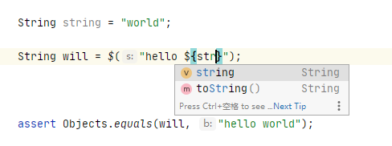
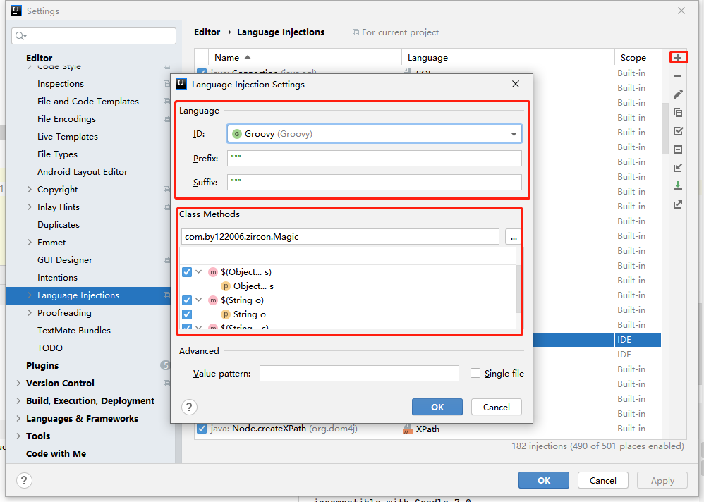

# Zircon 

支持在Java语言中使用内插字符串

    实现类似于kotlin、Groovy等语言中内插字符串
    
    支持android、java等所有使用javac的项目
    
    几乎不会增加额外编译时间
    
    代码内容支持idea补全提示（需自行配置）
    
    
 
 

* 使用示例
         
      String add = "test2";
      assertEquals($("test1 $add"), "test1 test2");
      
      assertEquals($("test1 ${\"Test,mode\".substring(0,6)}${1+2}"), "test1 Test,m3");
          
* 插件引入

    **使用Gradle构建项目**

    Step 1. 在你的根目录项目`build.gradle`文件中进行如下操作

	    allprojects {
		    repositories {
		    	...
		    	maven { url 'https://jitpack.io' }
		    }
		    //如果编译安卓项目，加入以下代码
		    gradle.projectsEvaluated {
                tasks.withType(JavaCompile) {
                     options.compilerArgs << "-Xplugin:ZrString"
                }
            }
	    }

    Step 3. 在需要使用插件的module的`build.gradle`文件中进行如下操作

	    dependencies {
	        ...
	        annotationProcessor 'com.github.122006.Zircon:javac:版本号'
            implementation 'com.github.122006.Zircon:impl:版本号'
	    }

    当前版本号：
	    
	    //如果编译标准java项目(非安卓项目)，加入以下代码
	    compileJava {
            options.compilerArgs  << "-Xplugin:ZrString"
        }
        
    **使用Maven构建项目**
    
    Step 1. 增加依赖

	    <dependency>
            <groupId>com.github.122006.Zircon</groupId>
            <artifactId>plugin</artifactId>
            <version>版本号</version>
        </dependency>
        <dependency>
            <groupId>com.github.122006.Zircon</groupId>
            <artifactId>impl</artifactId>
            <version>版本号</version>
        </dependency>
        
    Step 2. 配置jitpack仓库

	    <repositories>
        	<repository>
        	    <id>jitpack.io</id>
        	    <url>https://jitpack.io</url>
        	</repository>
        </repositories>
    当前版本号：
	    
    Step 2. 配置javac参数("-Xplugin:ZrString")
    
    
        <plugin>
          <groupId>org.apache.maven.plugins</groupId>
          <artifactId>maven-compiler-plugin</artifactId>
          <configuration>
            <compilerArgs>
              <arg>-Xplugin:ZrString</arg>
            </compilerArgs>
          </configuration>
        </plugin>
        
* 配置IDEA自动补全参数（使用IDEA内置`IntelliLang`插件）

   
           
   Step 1: Setting->->Editor->Language Injection
        
   Step 2: 点击右侧'+'按钮 选择'`Java Parameter`'
   
   >(可选择导入配置文件以省略以下参数配置)[配置文件][others/ZrLanguageInjection.xml]
   
   Step 3: 手动配置参数：
   
   
        Lauguage: Groovy
        Prefix: """    (3个双引号)
        Suffix: """    (3个双引号)
        Class Methods: com.by122006.zircon.Magic 并勾选所有方法

* 其他注意事项

   * $()方法中任何字符串都会被检测是否含有'${}'标识，请注意'${}'内容代码的正确性
   
* 代码注入说明
        
   1. 由于使用Groovy作为代码补全注入语言，会附带Groovy的语言特性，请不要使用这些特性
            
        > 注：由于LanguageInjection的限制，使用JAVA作为注入语言时会出现无法换行等问题，如果有解决方案请指教
   
   2. 注入时检查在极端情况下可能报错，但不会导致编译运行报错，可忽略
   
   3. 如果在字符串中使用美元符号`$`，请使用转义符`\\$`
   
* 更新计划

    1. 开发相关idea插件自动化配置及字符串相关提示
    
    2. 使用$"" 以替代$("") 形式实现
    
    3. 更多特殊语法
        