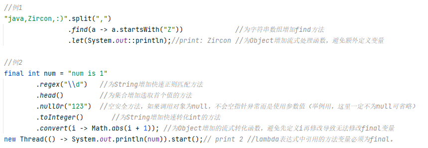

# Zircon [](https://jitpack.io/#122006/Zircon)<a href="https://github.com/122006/Zircon/releases"></a><a href="https://plugins.jetbrains.com/plugin/19146-zircon"></a>

-----------------

## Zircon可以让你在Java语言代码中直接使用一些特殊的语法

----------------  

#### 已支持的语法特性：

### 1. 全局拓展方法

> 自由拓展已有代码的实现方法。可以实现诸如顶级方法、方法替换等功能

### 2. 内插模板字符串

`String text=$"My name is $ID.name ";//简单使用`

`String text=f"My age is ${%02d:ID.age} ";//带格式化的模板字符串`
> 字符串插值功能构建在复合格式设置功能的基础之上，提供更具有可读性、更方便的语法，用于将表达式结果包括到结果字符串。

---------------

1. 支持android、springboot、javaFX等所有使用java语言的项目（javac）

---------------

### 使用示例



### 使用说明

#### [内插模板字符串（点击跳转）](mds/README_ZrString.md)

#### [全局拓展方法（点击跳转）](mds/README_ZrExMethod.md)

### 插件引入

<details>
  <summary>使用Gradle构建项目(点击展开)</summary>

#### 使用ZrString插件自动引入依赖

Step 1.在你的根项目`build.gradle`文件中进行如下操作

````
buildscript {
    repositories {
        maven { url 'https://jitpack.io' }
    }
    dependencies {
        classpath 'com.github.122006.Zircon:gradle:3.1.9'
    }
}
````

当前版本号：[](https://jitpack.io/#122006/Zircon)

Step 2.在需要使用插件的module的`build.gradle`首行引入插件`apply plugin: 'zircon'`

</details>
<details>
  <summary>使用Maven构建项目(点击展开)</summary>
Step 1. 增加依赖
	    <dependency>
            <groupId>com.github.122006.Zircon</groupId>
            <artifactId>javac</artifactId>
            <version>3.1.9</version>
            <scope>provied</scope>
        </dependency>
	    <dependency>
            <groupId>com.github.122006.Zircon</groupId>
            <artifactId>zircon</artifactId>
            <version>3.1.9</version>
        </dependency>

Step 2. 配置jitpack仓库

	    <repositories>
        	<repository>
        	    <id>jitpack.io</id>
        	    <url>https://jitpack.io</url>
        	</repository>
        </repositories>

当前版本号：[](https://jitpack.io/#122006/Zircon)

Step 3. 配置javac参数 `-Xplugin:ZrExMethod -Xplugin:ZrString`

        <plugin>
          <groupId>org.apache.maven.plugins</groupId>
          <artifactId>maven-compiler-plugin</artifactId>
          <configuration>
            <compilerArgs>
              <arg>-Xplugin:ZrExMethod</arg>
              <arg>-Xplugin:ZrString</arg>
            </compilerArgs>
          </configuration>
        </plugin>

</details>

### 安装IDEA插件

#### 手动安装（推荐）

1. 点击 [这里\[ijplugin.zip\]](ijplugin/build/distributions/ijplugin-3.3.zip)
   进行下载（或目录中`/ijplugin/build/distributions/ijplugin-xxx.zip`文件）
2. 下载文件后拖动至idea中自动安装

#### ide内插件仓库加载

For Windows & Linux - <kbd>File</kbd> > <kbd>Settings</kbd> > <kbd>Plugins</kbd> > <kbd>Marketplace</kbd> > <kbd>Search
for "Zircon"</kbd> > <kbd>Install Plugin</kbd> > <kbd>Restart IntelliJ IDEA</kbd>

For Mac - <kbd>IntelliJ IDEA</kbd> > <kbd>Preferences</kbd> > <kbd>Plugins</kbd> > <kbd>Marketplace</kbd> > <kbd>Search
for "Zircon"</kbd> > <kbd>Install Plugin</kbd>  > <kbd>Restart IntelliJ IDEA</kbd>

#### 网页加载

<a href="https://plugins.jetbrains.com/plugin/19146-zircon">
    
</a>

### 其他注意事项

1. 请注意保持idea插件更新到最新。插件仓库审核有可能有滞后，请优先手动安装

--------------

## TODO 后续更新计划

1. **面板字符串**
   > 形如`$"#{person.name}"`=`"person.name"`,或者`$"#{\.(\S+):person.name}"`=`"name"`。默认收缩

   > 用于调试日志输出、打印字面量、sql等，可以考虑新建一个模板字符串类型

--------------

## ChangeLog


### v3.1.9

1. 重用已解析的参数类型提高编译速度。
2. 修复罕见情况下的多层匿名类指向错误的问题

<details>
  <summary>历史依赖更新</summary>

### v2.2

1. 重构已有代码，提高编译性能及拓展性
2. 使用gradle编译idea插件

### v2.4

1. 支持jdk11、android30

### v2.5

1. 支持内部代码段中使用不转义的引号

### v2.7

1. 不再支持使用单引号转义双引号语法
2. 支持使用gradle插件配置项目
3. 重构以支持jdk16、jdk17

### v3.0

1. 支持拓展方法

### v3.1.2

1. 支持在成员方法引用中对外部引用调用拓展方法的情况

### v3.1.3

1. 修复了一个导致编译时间过长的问题

### v3.1.4

1. gradle插件支持使用id方式引入


### v3.1.6

1. 修复一个特殊情况下与已有方法同名异参的会解析错误问题
2. 修复强制覆盖原有实现方法时，使用方法引用会提示引用重复的问题

### v3.1.8

1. 修复idea中使用Maven构建项目build错误的问题

</details>

### idea插件3.5

1. 强化自动补全功能对代理类泛型的支持：优化泛型继承解析

<details>
  <summary>历史idea插件更新</summary>

### idea插件2.0
1. 支持`f-string`自动提示格式符及类型匹配错误
2. 普通字符串支持自动识别转化为`$-string`

### idea插件2.1

1. 模板字符串结构字符会用特殊颜色标出

### idea插件2.3

1. 修复启动后一段时间代码异常检查失效的问题

### idea插件2.4

1. 支持拓展方法
2. 在未引入该项目的代码中，不再提示模板字符串功能

### idea插件2.5

1. 拓展方法显示优化

### idea插件2.6

1. 拓展方法显示优化

### idea插件2.7

1. 拓展方法自动引包相关支持

### idea插件2.8

1. 支持在成员方法引用中对外部引用调用拓展方法的情况

### idea插件2.9

1. 在idea 203以上版本支持了拓展方法引用处点击跳转。203以下版本会跳转到代理对象

### idea插件3.0

1. 重构了拓展方法及自动提示。现在已支持代理泛型推断及泛型数组推断

### idea插件3.1

1. 增强了模板字符串和拓展函数的联合效果。使用拓展函数支持自动引包

### idea插件3.2

1. 修复idea2023.3版本的兼容性问题
2. 当输入于变量后自动补全时，不再提示其静态方法

### idea插件3.3

1. 修复部分问题

### idea插件3.4

1. 强化自动补全功能对代理类泛型的支持

</details>

## 相关项目

### ExMethodUtil
   项目[ExMethodUtil](https://github.com/122006/ExMethodUtil)封装了常见的java工具方法，可用于体验或者测试拓展方法功能。

   > Zircon主体项目中不包含任何预定义的拓展方法，你可以引入该项目快速体验Zircon

   `implementation 'com.github.122006:ExMethodUtil:1.0.6'`
