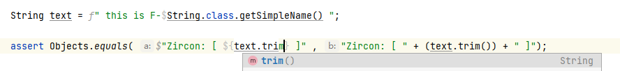
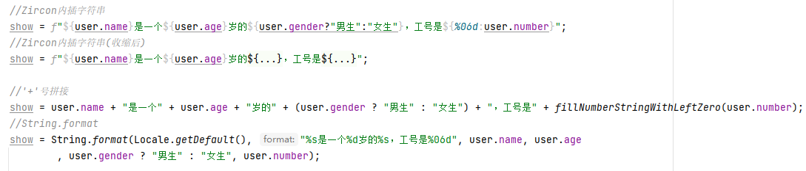

# Zircon 

-----------------

## Zircon可以让你在Java语言中使用内插字符串语法

----------------  

###    什么叫内插字符串？  

> 字符串插值功能构建在复合格式设置功能的基础之上，提供更具有可读性、更方便的语法，用于将表达式结果包括到结果字符串。

>对某个表达式执行计算后，其结果立即转换为一个字符串并包含到结果字符串中

### 如何使用内插字符串

>若要将字符串标识为内插字符串，可在该字符串前面加上 `$`或`f` 符号。 可嵌入任何会在内插字符串中返回值的有效 JAVA 表达式。

###    特性  

1. 支持android、java等所有使用javac的项目
    
2. 几乎不会增加额外编译时间
    
3. 代码内容支持idea补全提示（需安装idea插件） 

4. 更多内插字符串语法糖支持

###    效果图

 

 常见字符串拼接写法对比
 

----------------  
### 使用示例

`String text=f" this is F-$String.class.getSimpleName() ";`

`assert Objects.equals($"Zircon: [ ${text.trim()} ]","Zircon: [ "+text.trim()+" ]");`

----------------  

### 高级语法糖

1. 根据字符串前的前缀不同，拥有不同的字符串内插逻辑，请注意区别使用

    #### 1. `$`前缀字符串(`$-string`):

   > 直接使用加号进行字符串的拼接，拥有最快的运行

   1. JDK1.6的情况，javac遇到加号(`+`)链接的字符串会自动转化成`StringBuilder.append()`，不存在加号连接字符串额外的对象开销

   2. 如果首个子部分为非硬编码字符串，会自动包裹`String.valueOf()`以防止拼接异常

    #### 2. `f`前缀字符串(`f-string`):
      
    > 使用String.format函数进行拼接，速度相比`$-string`较慢

    1. 如果是使用大括号包裹的`${}`代码块，你可以指定的每个内插代码块的显示格式：
       在代码块的前部，增加一个以`%`号开始的`String.format`格式化标识，并且使用`:`与后续代码块进行分隔 。形如：`${%03d:12}`会输出`012`的格式化结果

2. 未被大括号`{}`包裹的简易代码块，拥有java特性自动识别代码范围的功能

    1. 请不要完全依赖该功能，只能简单判断括号匹配及后续引用，复杂语句请使用`${}`
  
    2. 如果要使用该功能，请注意根据插件提示的java代码注入范围来判断是否使用错误

3. 字符串中代码段支持直接使用引号而不需要转义（需配置1.8版本以上idea插件+v2.5以上编译插件）

---------------
### 插件引入

**使用Gradle构建项目**

Step 1. 在你的根目录项目`build.gradle`文件中进行如下操作

	    allprojects {
		    repositories {
		    	...
		    	maven { url 'https://jitpack.io' }
		    }

	    }

Step 2. 在需要使用插件的module的`build.gradle`文件中进行如下操作

	    dependencies {
	        ...
	        annotationProcessor 'com.github.122006.Zircon:javac:版本号'
	    }

当前版本号：

如果编译安卓项目，module的`build.gradle`文件中加入以下代码，以配置javac参数

		tasks.withType(JavaCompile) {
               options.compilerArgs  << "-Xplugin:ZrString"
           }

如果编译标准java项目(非安卓项目)，以配置javac参数

	    compileJava {
               options.compilerArgs  << "-Xplugin:ZrString"
           }
        
**使用Maven构建项目**
    
Step 1. 增加依赖

	    <dependency>
            <groupId>com.github.122006.Zircon</groupId>
            <artifactId>javac</artifactId>
            <version>版本号</version>
        </dependency>
        
Step 2. 配置jitpack仓库

	    <repositories>
        	<repository>
        	    <id>jitpack.io</id>
        	    <url>https://jitpack.io</url>
        	</repository>
        </repositories>

当前版本号：
	    
Step 2. 配置javac参数 `("-Xplugin:ZrString")`

        <plugin>
          <groupId>org.apache.maven.plugins</groupId>
          <artifactId>maven-compiler-plugin</artifactId>
          <configuration>
            <compilerArgs>
              <arg>-Xplugin:ZrString</arg>
            </compilerArgs>
          </configuration>
        </plugin>
        
### 安装IDEA插件

  本插件尚未发布至idea仓库，请手动下载安装

1. 点击 [这里\[ijplugin.zip\]](ijplugin/build/distributions/ijplugin-1.8.zip) 进行下载（或目录中`/ijplugin/build/distributions/ijplugin-xxx.zip`文件）
2. 下载文件后拖动至idea中自动安装
   

### 其他注意事项

1. 请注意保持idea插件更新到最新

--------------

## TODO 后续更新计划

 1. idea插件监听项目使用的javac版本，以判断是否生效该功能
 2. 增加对代码段中双引号无需转义的支持（以替代单引号）

--------------

## ChangeLog

### v2.2 
 1. 重构已有代码，提高编译性能及拓展性
 2. 使用gradle编译idea插件

### v2.4
 1. 支持jdk11、android30
