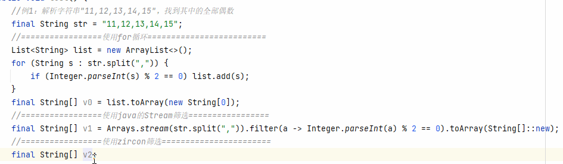

# Zircon

[简体中文](README.md) | **English**

[](https://central.sonatype.com/artifact/io.github.122006.Zircon/zircon)
[](https://github.com/122006/Zircon/releases)
[](https://plugins.jetbrains.com/plugin/19146-zircon)

[](LICENSE)

Zircon adds **extension methods, optional chaining, Elvis expressions, and template strings** to Java. Integrate it into an existing project with the javac compiler plugin, then use the IntelliJ IDEA or VS Code plugin for completion, navigation, and semantic checks.

The compiler produces standard Java bytecode, so no custom JVM is required. Zircon works with Java, Android, Spring Boot, JavaFX, and other projects built with javac. Keep any dependencies your application uses at runtime.

[Quick start](#quick-start) · [Editor support](#editor-support) · [Syntax documentation](#syntax-documentation) · [FAQ](#faq) · [Changelog](CHANGELOG.md)

## Versions

| Component | Current version | Purpose |
| --- | --- | --- |
| Zircon compiler and core dependencies | **3.3.5** | `gradle`, `javac`, `zircon`, and `base` |
| IntelliJ IDEA plugin | 4.9 | One ZIP that selects the appropriate implementation for your IDEA version |
| VS Code extension | 0.0.1 | Editor support under active development; see installation steps below |

Compiler dependencies and editor plugins are versioned independently. Their version numbers do not need to match.

## Syntax at a glance

### Extension methods

Add new ways to call methods on existing types without modifying the original class. An instance extension method must be a static method whose first parameter is the receiver:

```java
package demo;

import zircon.ExMethod;

public class TextExtensions {
    @ExMethod
    public static boolean isBlankText(String text) {
        return text == null || text.trim().isEmpty();
    }
}
```

Import the extension's declaring class in the file where you call it:

```java
import demo.TextExtensions;

boolean empty = "  ".isBlankText(); // Equivalent to TextExtensions.isBlankText("  ")
```

Zircon also supports static extensions, generics, method references, method replacement through `cover`, and annotation constraints through `filterAnnotation`. See the [extension methods guide](mds/README_ZrExMethod.md) (Chinese).



### Optional chaining and Elvis expressions

```java
String text = null;
String trimmed = text?.trim();          // null
String display = text?.trim() ?: "default";
Integer count = null;
int size = count ?: 0;
```

`?.` short-circuits the current chain when the receiver is `null`. `?:` uses the right-hand default when the left-hand result is `null`. If an optional chain ends in a primitive result, supply a default with `?:` to avoid a null pointer exception on the null path.

Parentheses affect the scope of short-circuiting, and optional chains on the left-hand side of assignments have specific rules. See the [optional chaining and Elvis guide](mds/README_ZrOptionalChaining.md) (Chinese).

### Template strings

```java
String name = "Zircon";
int age = 7;
String greeting = $"Hello, ${name.toUpperCase()}!";
String formatted = f"Age: ${%02d:age}"; // Age: 07
```

`$"…"` uses string concatenation, while `f"…"` supports `String.format` specifiers. Put complex expressions inside `${…}`. See the [template strings guide](mds/README_ZrString.md) (Chinese).

## Quick start

Configure the build dependencies first, then install an editor plugin if needed. The javac plugin handles compilation; the editor plugin provides completion, navigation, and semantic checks.

All four compiler modules are available from Maven Central under `io.github.122006.Zircon`.
Gradle needs only `mavenCentral()`; Maven uses Central by default. No additional repository is required.
Maintainers can follow the [Central publishing guide](gradle/CENTRAL_PUBLISHING.md) (Chinese).

### Gradle (Groovy DSL)

For a single-module Java project, add the following to `build.gradle`:

```groovy
buildscript {
    repositories {
        mavenCentral()
    }
    dependencies {
        classpath 'io.github.122006.Zircon:gradle:3.3.5'
    }
}

apply plugin: 'java'
apply plugin: 'zircon'

repositories {
    mavenCentral()
}
```

For a multi-module project, place `buildscript` in the root project, apply the `zircon` plugin in each module that needs it, and include `mavenCentral()` in those modules' dependency repositories. Keep any existing Java or Android plugin configuration.

The Gradle plugin adds the Zircon dependencies and the `ZrOptionalChain`, `ZrExMethod`, and `ZrString` compiler arguments. Sync the project after making these changes.

The `javac`, `base`, and `zircon` dependencies use `io.github.122006.Zircon` and the same version as the Gradle plugin. Compiler dependencies go on the annotation processor path, and `zircon` is added to the application runtime.
See [Gradle plugin configuration and tests](gradle/GRADLE_PLUGIN.md) (Chinese) for repositories, dependency scopes, and compatibility details.

### Maven

Merge the following configuration into `pom.xml`. This example targets Java 8; adjust it to your project's requirements:

```xml
<properties>
    <zircon.version>3.3.5</zircon.version>
    <maven.compiler.source>8</maven.compiler.source>
    <maven.compiler.target>8</maven.compiler.target>
</properties>

<dependencies>
    <dependency>
        <groupId>io.github.122006.Zircon</groupId>
        <artifactId>javac</artifactId>
        <version>${zircon.version}</version>
        <scope>provided</scope>
    </dependency>
    <dependency>
        <groupId>io.github.122006.Zircon</groupId>
        <artifactId>zircon</artifactId>
        <version>${zircon.version}</version>
    </dependency>
    <dependency>
        <groupId>io.github.122006.Zircon</groupId>
        <artifactId>base</artifactId>
        <version>${zircon.version}</version>
    </dependency>
</dependencies>

<build>
    <plugins>
        <plugin>
            <groupId>org.apache.maven.plugins</groupId>
            <artifactId>maven-compiler-plugin</artifactId>
            <version>3.13.0</version>
            <configuration>
                <compilerArgs>
                    <arg>-Xplugin:ZrOptionalChain</arg>
                    <arg>-Xplugin:ZrExMethod</arg>
                    <arg>-Xplugin:ZrString</arg>
                </compilerArgs>
            </configuration>
        </plugin>
    </plugins>
</build>
```

If your project already configures `annotationProcessorPaths`, add the same version of `io.github.122006.Zircon:javac` to that path and keep the existing processors. Installing an editor plugin alone does not enable Zircon syntax in Maven or CI builds.

## Editor support

### IntelliJ IDEA

1. Download the [Zircon IDEA plugin 4.9](ijplugin/build/distributions/ijplugin-4.9.zip).
2. Open **Settings → Plugins → gear icon → Install Plugin from Disk…** and select the downloaded ZIP file.
3. Restart IDEA after installation.

You can also search for and install Zircon on the [JetBrains Marketplace](https://plugins.jetbrains.com/plugin/19146-zircon).

The plugin automatically selects the appropriate implementation for your IDEA version.

For build, test, and version adapter details, see the [IDEA plugin README](ijplugin/README.md) (Chinese).

### VS Code

Install VS Code 1.75 or later and [Language Support for Java by Red Hat](https://marketplace.visualstudio.com/items?itemName=redhat.java) (`redhat.java`), then configure a JDK that meets its Java Language Server requirements.

Choose either of the following ways to obtain the installation package.

#### Option 1: Use the prebuilt VSIX

Use the prebuilt `vscode_plugin/zircon-vscode-<version>.vsix` package.

#### Option 2: Build the VSIX from source

Set up the [build environment](vscode_plugin/README.md#从源码构建) (Chinese), then run this command at the repository root:

```powershell
.\gradlew.bat :vscode_plugin_agent:packageVsix
```

On macOS or Linux, use `./gradlew` instead of `.\gradlew.bat`. The generated package is saved to `vscode_plugin/zircon-vscode-<version>.vsix`.

#### Install and enable

1. In the VS Code Extensions view, open **… → Install from VSIX…** and select the VSIX file obtained through either option above.
2. Open a Java project configured with Zircon compiler dependencies and restart the Java Language Server when prompted.
3. Run `Zircon: 查看项目状态` (view project status) to check project detection and Agent injection.

The extension integrates with native completion, references, rename, CodeLens, and call hierarchy through a JDT Agent. It also provides syntax checks, intention actions, bulk conversions, formatting, and import optimization. For build requirements, commands, and troubleshooting, see the [VS Code extension README](vscode_plugin/README.md) (Chinese).

## Syntax documentation

The detailed guides below are currently in Chinese:

- [Extension methods](mds/README_ZrExMethod.md): declarations, imports, generics, replacement rules, and annotation constraints.
- [Optional chaining and Elvis expressions](mds/README_ZrOptionalChaining.md): short-circuiting, defaults, assignments, and parentheses.
- [Template strings](mds/README_ZrString.md): interpolation, format specifiers, quotes, and expression boundaries.

## FAQ

### Why does the command-line build still report syntax errors after installing the editor plugin?

Check that the project includes matching versions of the Zircon compiler dependencies and that javac loads all three plugins listed above. VS Code uses JDT for editor services, but the project build still needs a configured javac compiler.

### Why is an extension method missing from completion or failing to resolve?

Ensure the method is `static`, has `@ExMethod`, and its declaring class is imported in the calling file. Also check the receiver type, generic constraints, and `filterAnnotation`. Sync the project after adding or updating dependencies. In VS Code, use the commands `Zircon: 查看项目状态` (view project status) and `Zircon: 刷新扩展方法索引` (refresh the extension method index); these are their current command palette labels.

### Is there a recommended extension library?

Zircon does not include predefined extension methods. We recommend [ZirconExtensions](https://github.com/122006/ZirconExtensions), which provides null handling, collection transformations, text parsing, and I/O extensions. After adding the library, import the relevant extension class in the calling file, such as `zircon.extensions.CollectionExtensions`.

You can also define your own extension methods with `@ExMethod`. See the [extension methods guide](mds/README_ZrExMethod.md) (Chinese).

## Contributing

Shared syntax handling and string splitting live in `base`. javac integration lives in `javac` and `inject_java*`. Editor code lives in `ijplugin*`, `vscode_plugin`, and `vscode_plugin_agent`.

Use the repository's Gradle Wrapper. The editor READMEs contain build instructions for IDEA and VS Code. See the [compiler regression examples](test/src/test/java/test) for syntax behavior.

## License

[Apache License 2.0](LICENSE)
