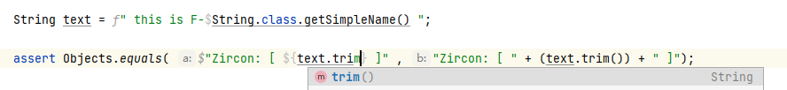
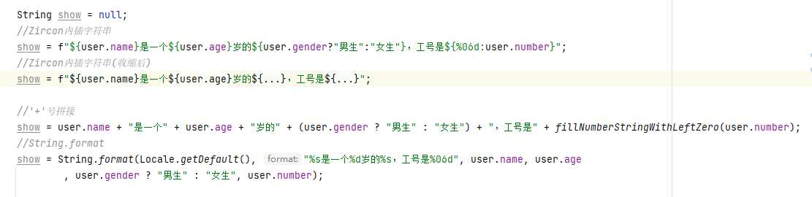

###    什么叫内插字符串？  

> 字符串插值功能构建在复合格式设置功能的基础之上，提供更具有可读性、更方便的语法，用于将表达式结果包括到结果字符串。

>对某个表达式执行计算后，其结果立即转换为一个字符串并包含到结果字符串中

### 如何使用内插字符串

>若要将字符串标识为内插字符串，可在该字符串前面加上 `$`或`f` 符号。 可嵌入任何会在内插字符串中返回值的有效 JAVA 表达式。

###    效果图

 

 常见字符串拼接写法对比
 

----------------  
### 使用示例

`String text=f" this is F-$String.class.getSimpleName() ";`

`assert Objects.equals($"Zircon: [ ${text.trim()} ]","Zircon: [ "+text.trim()+" ]");`

----------------  

### 高级语法糖

1. 根据字符串前的前缀不同，拥有不同的字符串内插逻辑，请注意区别使用

    #### 1. `$`前缀字符串(`$-string`):

   > 直接使用加号进行字符串的拼接，拥有最快的运行

   1. JDK1.6的情况，javac遇到加号(`+`)链接的字符串会自动转化成`StringBuilder.append()`，不存在加号连接字符串额外的对象开销

   2. 如果首个子部分为非硬编码字符串，会自动包裹`String.valueOf()`以防止拼接异常

    #### 2. `f`前缀字符串(`f-string`):
      
    > 使用String.format函数进行拼接，速度相比`$-string`较慢

    1. 如果是使用大括号包裹的`${}`代码块，你可以指定的每个内插代码块的显示格式：
       在代码块的前部，增加一个以`%`号开始的`String.format`格式化标识，并且使用`:`与后续代码块进行分隔 。形如：`${%03d:12}`会输出`012`的格式化结果

2. 未被大括号`{}`包裹的简易代码块，拥有java特性自动识别代码范围的功能

    1. 请不要完全依赖该功能，只能简单判断括号匹配及后续引用，复杂语句请使用`${}`
  
    2. 如果要使用该功能，请注意根据插件提示的java代码注入范围来判断是否使用错误

3. 字符串中代码段支持直接使用引号而不需要转义（需配置1.9版本以上idea插件+v2.5以上编译插件）
    
    > 在2.0及以上版本，**不再支持使用单引号替代双引号**，单引号转义在复杂字符串中难以进行解析。
    >
    > 你可以使用正则 `(\$|f)"(.*'.*)+?"` 全局搜索项目以找到可能影响的地方 
